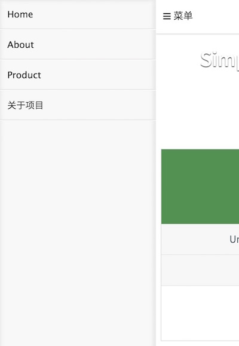

##Moqi Mobile CMS 前端

效果页面: [http://cms.moqi.mobi](http://cms.moqi.mobi)

###DEPENDENCIES

 - Backbone
 - RequireJS
 - Underscore
 - Mustache
 - Pure CSS 

###带后台 CMS

[https://github.com/phodal/freerice](https://github.com/phodal/freerice)

后台: Nodejs + RESTify + db-migrate(SQLite3)

后台测试: Sinon + Mocha + Chai

前台: MoQi CMS

前台测试: jasmine-jquery + Jasmine + Sinon

Screenshot:

##相关

1. [构建基于Javascript的移动web CMS入门——简介](http://www.phodal.com/blog/use-jquery-backbone-mustache-build-mobile-app-cms/)

2. [构建基于Javascript的移动web CMS——Hello,World](http://www.phodal.com/blog/use-jquery-backbone-mustache-build-mobile-app-cms-simple-example/)

3. [构建基于Javascript的移动web CMS——模板](http://www.phodal.com/blog/use-jquery-backbone-mustache-build-mobile-app-cms-generate-html/)

4. [构建基于Javascript的移动web CMS——添加jQuery插件](http://www.phodal.com/blog/use-jquery-backbone-mustache-build-mobile-app-cms-add-jquery-plugins/)

5. [构建基于Javascript的移动web CMS——整合Django](http://www.phodal.com/blog/use-jquery-backbone-mustache-build-mobile-app-cms-work-with-django/)

6. [构建基于Javascript的移动web CMS——加载JSON文件](http://www.phodal.com/blog/use-jquery-backbone-mustache-build-mobile-app-cms-json-configure/)

7. [构建基于Javascript的移动web CMS——生成博客(一)](http://www.phodal.com/blog/use-jquery-backbone-mustache-build-mobile-app-cms-a-simple-blog/)

8. [构建基于Javascript的移动CMS——生成博客(二).路由](http://www.phodal.com/blog/use-jquery-backbone-mustache-build-mobile-app-cms-add-blog-router/)

9. [构建基于Javascript的移动CMS——生成博客(三).重构](http://www.phodal.com/blog/use-jquery-backbone-mustache-build-mobile-app-cms-blog-refactor/)

10. [构建基于Javascript的移动CMS——添加滑动](http://www.phodal.com/blog/use-jquery-backbone-mustache-build-mobile-app-cms-add-swipe/)

## License

© 2014 Phodal Huang. This code is distributed under the MIT license.